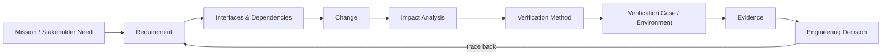

# Sakarya Aerospace — Engineering Showcase

Public engineering showcase for **Sakarya Aerospace / SUHAVX**.

**Open engineering • Reproducible evidence • Human-reviewed decisions**

We are exploring verification intelligence for complex aerospace and unmanned-system integration: how requirements, interfaces, changes, verification activities, evidence, and engineering decisions remain traceable to one another.

> **Core question:** When something changes in a system, what must be verified again — and what existing evidence can still be trusted?

## Focus

- Systems Engineering
- Requirements & bidirectional traceability
- Interface and dependency reasoning
- Change-impact analysis
- Verification-method selection
- Simulation and Software-in-the-Loop (SIL)
- Evidence provenance and configuration awareness
- Reproducible engineering workflows

## Traceability

A verification result should be reconstructable in both directions:

**Mission Need → Requirement → Method → Environment → Verification Case → Evidence → Result → Engineering Decision**

and

**Engineering Decision → Result → Evidence → Verification Case → Environment → Method → Requirement → Mission Need**

Missing links are engineering information, too: a requirement without a verification case, evidence tied to an obsolete configuration, or a changed interface whose dependent requirements have not been reconsidered.

## Explore the showcase

| Area | What it demonstrates |
|---|---|
| [Verification Intelligence](docs/verification-intelligence.md) | Requirement → method → environment → evidence → decision reasoning |
| [Bidirectional Traceability](docs/traceability-demo.md) | Walking a verification claim forward and backward |
| [Interface Change Impact](docs/interface-change-impact.md) | Why a seemingly small subsystem/interface change can invalidate evidence |
| [Evidence Applicability](docs/evidence-applicability.md) | Provenance, configuration and evidence-reuse reasoning |
| [Mission Computer Latency](examples/mission-computer-latency.md) | Why a quantitative timing requirement needs a precise verification definition |
| [Executable Change-Impact Demo](examples/change-impact-demo/README.md) | Synthetic REUSE / REVIEW / REVERIFY demonstrator with tests |

### Showcase architecture

The executable demo is intentionally small enough to audit by eye. The goal is not to hide engineering judgment behind software; it is to make the reasoning chain visible, reviewable and reproducible.

## Open-source collaboration

This public showcase is licensed under the **Apache License 2.0**. External contributors are welcome to fork the repository, develop changes on their own branches, and propose them back through Pull Requests.

A public contribution never receives automatic access to the private Sakarya Aerospace verification laboratory. Public-to-private transfer is a separate, deliberate engineering decision.

## Public demo philosophy

Examples in this repository are intentionally simplified and use synthetic data. They demonstrate engineering reasoning and workflow design.

They are **not** flight-test evidence, hardware-qualification evidence, certification evidence, customer-program evidence, or a claim of accredited-laboratory status.

Internal R&D artifacts, proprietary source material, customer information, controlled data, credentials, and private program evidence are excluded from this public repository.

## Verification vocabulary

The formal verification methods used here are:

- **Inspection** — examination or review.
- **Analysis** — analytical or mathematical evaluation, including appropriately justified modeling/simulation.
- **Demonstration** — showing a capability or operation without the detailed measurement expected from a formal test.
- **Test** — controlled operation of a product, prototype, or test article to obtain detailed verification data.

SIL, HIL, bench, environmental test and flight test are verification **environments or implementation levels**, not additional formal verification methods.

## Current public demonstrator

**Change → Impact → Verification Decision → Evidence**

The demonstrator is being developed around three advisory outcomes:

- **REUSE** — existing evidence remains applicable with justification.
- **REVIEW** — engineering review is required because applicability is uncertain.
- **REVERIFY** — new verification evidence is required.

These are engineering recommendations for human review, not autonomous certification decisions.

---

**Sakarya Aerospace / SUHAVX**  
Systems Engineering • Verification Intelligence • Simulation • Digital Engineering
