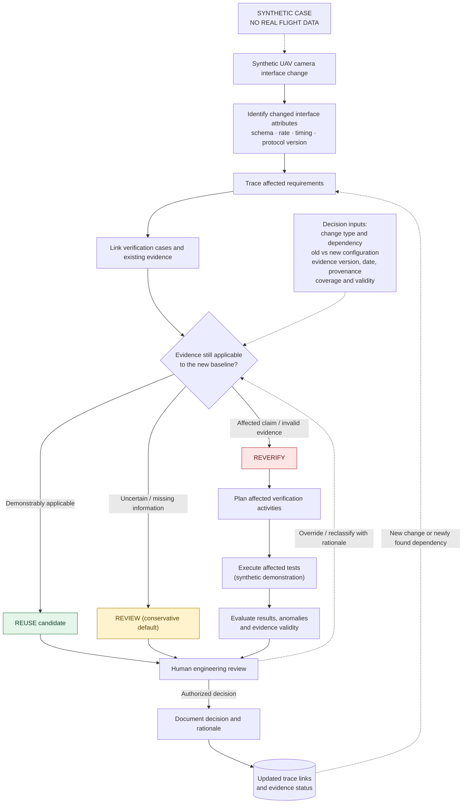
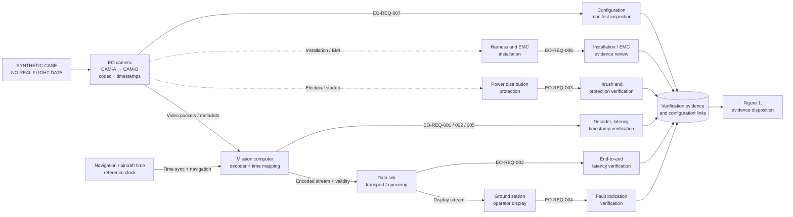

# Case Study 01 — Interface Change Decision Architecture

> **SYNTHETIC CASE — NO REAL FLIGHT DATA.** Educational model only. All examples, requirements and test identifiers are fictional. REUSE, REVIEW and REVERIFY are recommendations subject to authorized human engineering review, not certification outcomes.

This companion to [UAV EO Camera Interface Change](01-uav-eo-camera-interface-change.md) isolates two complementary views: **(1) the evidence disposition workflow** and **(2) the propagation of a camera-interface change across interacting subsystems**. It also maps the case to the repository's [executable Change-Impact Demo](../examples/change-impact-demo/README.md).

## Figure 1 — Evidence disposition and closed-loop traceability

**How to read the decision:** A dependency change affecting a verification claim is a REVERIFY candidate. If configuration, test coverage, provenance or interface semantics cannot be established, use REVIEW as the conservative default. REUSE is a *candidate* only when applicability is positively justified; a missing dependency link is not proof of independence. The human reviewer can override any provisional label, with a recorded reason. A REVERIFY disposition does not itself constitute new evidence: verification must be planned, tests executed, results and anomalies evaluated, and the outcome reviewed. An executed test can fail or yield inconclusive evidence; neither outcome constitutes a verified requirement. The resulting status and trace links are updated before any future reuse decision.

**Diagram limitation:** The loop is a conceptual process model. The public executable demonstration uses simplified rules and does not implement human authorization, test execution, the full evidence schema, or every arrow shown here.

## Figure 2 — Multi-subsystem interface propagation

**Propagation is not necessarily causal failure.** The arrows identify interfaces and verification dependencies to inspect, not an assertion that every connected subsystem fails. A codec change may alter mission-computer processing load and end-to-end latency even when packet transport remains compatible. A timestamp semantic change may invalidate overlay alignment without changing nominal frame rate. An electrical startup transient may affect protection independently of video performance.

## Decision criteria and evidence inventory

| Criterion | Engineer asks | Consequence if unresolved |
|---|---|---|
| Interface delta | Did message schema, codec, rate, timing origin, protocol version or fault behavior change? | REVIEW until dependencies identified; REVERIFY affected claims |
| Dependency completeness | Are producer/consumer relationships and indirect couplings represented? | REVIEW; missing links cannot justify REUSE |
| Configuration applicability | Does evidence match relevant hardware, firmware, software, harness, environment and instrumentation? | REVIEW or REVERIFY depending on impact |
| Provenance and currency | Are test procedure, data source, date, revision, calibration and analysis script traceable? | REVIEW; do not accept an unexplained PASS |
| Coverage | Did the old test measure the same requirement, conditions, acceptance criteria and uncertainty? | REVERIFY where coverage is insufficient |
| Authority | Has a competent reviewer approved the disposition and rationale? | No approved reuse or acceptance |

### Walkthrough: synthetic camera replacement

1. **Change record:** `CR-EO-017` changes camera codec from H.264 to H.265 and frame timestamp meaning from exposure start to packet egress.
2. **Trace:** `EO-REQ-001` (decode throughput), `EO-REQ-002` (end-to-end latency) and `EO-REQ-005` (time alignment) depend on those changed attributes.
3. **Link evidence:** existing CAM-A H.264 throughput and latency results are tied to the old camera/decoder configuration. They cannot by themselves establish CAM-B compliance.
4. **Provisional disposition:** REVERIFY the three affected claims. For unrelated requirements, first check independence, evidence provenance and baseline applicability; then consider REUSE. Unknown fault-indication semantics route to REVIEW until resolved.
5. **Reverification plan:** for REVERIFY candidates define method, environment, procedure, acceptance criteria, sample coverage, uncertainty, roles and test readiness.
6. **Execution and evidence evaluation:** execute only the planned synthetic/illustrative tests (or program-approved tests in a real project); examine raw data, failures, anomalies, missing frames and configuration identity. A failed or inconclusive test remains unresolved. **No test execution is claimed in this document.**
7. **Human gate:** authorized engineering reviewers may adjust classifications and must record their reasoning.
8. **Update:** revise the VCRM, evidence links and decision log; unresolved findings remain open.

## Relation to the executable Change-Impact Demo

The existing [Change-Impact Demo](../examples/change-impact-demo/README.md) uses a *different* fictional change, `NAV_MESSAGE_RATE`, and three demonstration requirements. It intentionally implements these simplified rules:

1. Direct requirement dependency on changed item → `REVERIFY`.
2. Otherwise, evidence configuration mismatch → `REVIEW`.
3. Otherwise → `REUSE` candidate.

This camera case **illustrates how the same reasoning pattern can be applied** to richer multi-domain interfaces. It does **not** claim that the existing executable demo accepts camera data, implements these diagrams, reruns tests, checks evidence dates, or authorizes engineering decisions. Extending the executable demo to support this case would be a separate reviewed change with tests.

## Review checklist

- [ ] Changed interfaces and semantics have unambiguous before/after definitions
- [ ] Every impacted requirement links to a verification case and evidence record or an explicit evidence gap
- [ ] Evidence is matched to configuration and test method/environment
- [ ] REVIEW is used when applicability is uncertain
- [ ] Human override and rationale are recorded
- [ ] New tests produce traceable data rather than an unsubstantiated PASS
- [ ] Diagrams and data remain explicitly synthetic

**Sakarya Aerospace / SUHAVX — Open engineering • Reproducible evidence • Human-reviewed decisions.**
