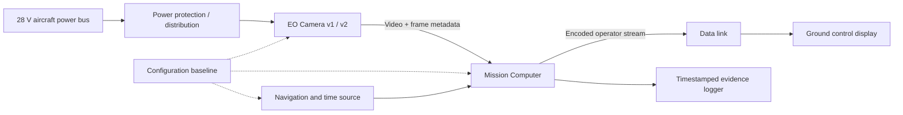
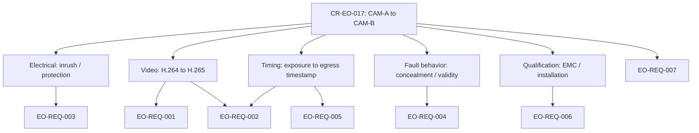
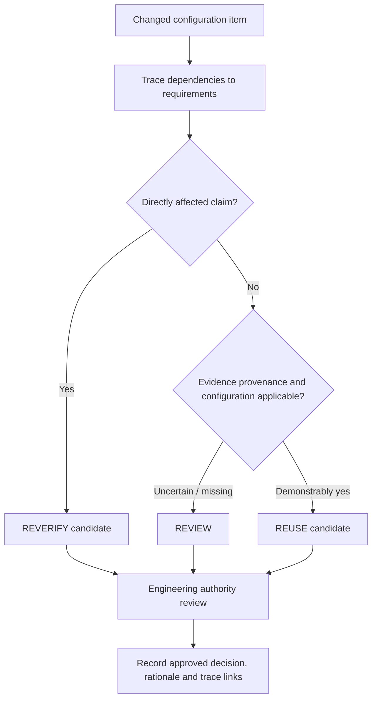
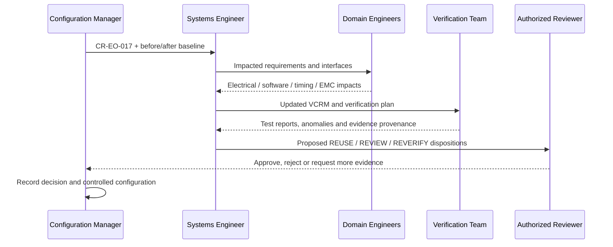

# Engineering Case Study 01 — UAV EO Camera Interface Change
## Requirements, cross-domain impact analysis, verification planning and evidence applicability

> **Status:** Public educational case study; synthetic system and synthetic numbers only. **Not** a design approval, flightworthiness statement, certification package, actual flight test, or evidence that Sakarya Aerospace has built this system. All thresholds and results are invented for teaching and must not be reused as product specifications.

**Audience:** Systems, avionics, embedded, software, integration, verification and configuration engineers.  
**Question:** A camera appears pin-compatible and streams video. Which system claims must be reassessed before its replacement can be accepted?

## 1. System context and boundary

A fictional unmanned aircraft carries an EO camera connected to a mission computer (MC). The MC receives video and frame metadata, aligns them to vehicle time, overlays navigation-derived context, and sends an operator display stream. The flight controller provides navigation/time messages; the camera is not a flight-critical control sensor in this teaching scenario. This boundary is an **assumption**, not a safety classification.



### Hypothetical baseline and proposed replacement

| Characteristic | Baseline CAM-A | Candidate CAM-B | Why it matters |
|---|---|---|---|
| Connector / nominal power | Same physical connector / 28 V | Same connector / 28 V | Physical fit does not establish electrical equivalence |
| Peak inrush | 1.8 A (assumed) | 3.6 A (assumed) | Protection and transient margin |
| Video | 1080p30, H.264 | 1080p30, H.265 | Decoder, bandwidth and computational load |
| Frame timestamps | Sensor exposure start, monotonic | Packet egress, device-local clock | Time semantics and synchronization |
| Nominal glass-to-glass latency | 140 ms (illustrative) | 115 ms (vendor claim, unverified) | Measurement definitions may differ |
| Packet loss behavior | Last-frame freeze with status flag | Frame concealment, flag undocumented | Operator awareness and integrity |
| EMC evidence | CAM-A configuration only | No accepted CAM-B evidence yet | Cannot transfer qualification by connector match |
| Firmware | A-2.4 | B-1.1 | Configuration identification and repeatability |

**Important:** These are deliberately invented characteristics, not statements about any real camera or vendor. A lower quoted latency is **not** evidence of lower end-to-end latency unless start/end events, clock alignment, loading and statistics match.

## 2. Define the change as a configuration delta

Change request `CR-EO-017`: replace CAM-A with CAM-B in synthetic configuration `UAV-DEMO-CFG-02`. Do not reduce the change to a part-number substitution. Record the affected items: camera hardware and firmware, MC decoder/software build, electrical protection settings, metadata parser, time-sync mapping, ground display behavior, wiring/connector revision, and verification environment.

**Entry criteria:** approved change description, before/after interface control data, requirements baseline, dependency links, safety/assurance assumptions, current evidence inventory and ownership for technical decisions.

**Unknowns requiring evidence:** actual inrush waveform and duration, codec support under load, timestamp meaning and drift, fault indications, transport recovery, EMC effects, temperature and vibration envelope.

## 3. Requirements: make each claim measurable

All identifiers and thresholds below are synthetic training examples.

| ID | Synthetic requirement | Verification method | Environment | Acceptance evidence |
|---|---|---|---|---|
| EO-REQ-001 | MC shall decode 1920×1080 at ≥30 frames/s for a continuous 30-minute run under defined CPU load | Test | SIL/bench | Frame-count log, dropped-frame distribution, build IDs |
| EO-REQ-002 | 99th-percentile exposure-to-display latency shall be ≤220 ms over 10,000 paired frames under the stated network profile | Test + Analysis | Instrumented bench | Common-clock trace, pairing algorithm, distribution |
| EO-REQ-003 | Camera supply shall not trip the selected protection element during startup over defined voltage/temperature corners | Test | Electrical bench | Current waveform, protection curve, corner matrix |
| EO-REQ-004 | Display shall visibly indicate video invalidity within 500 ms of a simulated camera-stream interruption | Test | HIL/bench | Injected fault log and synchronized display recording |
| EO-REQ-005 | Every displayed frame's capture-time field shall map to aircraft reference time with absolute error ≤10 ms | Test + Analysis | Synchronized bench | Clock model, reference trace, error histogram |
| EO-REQ-006 | Installed camera and harness shall satisfy the program's defined EMC acceptance criteria | Test / Inspection | Accredited or otherwise program-approved facility, as required | Applicable test report and installation record |
| EO-REQ-007 | The verification package shall identify hardware, firmware, software, harness, test scripts and calibration revisions | Inspection | Document/configuration review | Baseline manifest and trace links |

Formal methods are **Inspection, Analysis, Demonstration, Test**. SIL/HIL/bench/environmental/flight are **environments or levels**, not formal method categories. The combination “Test + Analysis” denotes separate evidence activities, not a fifth method.

## 4. Interface contract, not just connector matching



For every interface dimension record: producer, consumer, units, coordinate/time reference, encoding, rates, tolerances, initialization, fault states, version, and evidence source. “Same Ethernet connector” does not mean equivalent message semantics, timing, recovery behavior or electromagnetic characteristics.

### Timestamp trap

CAM-A timestamps exposure start. CAM-B timestamps packet egress. Suppose (invented) capture-to-egress delay varies between 12–28 ms. Treating both fields as exposure timestamps introduces a variable 12–28 ms bias. Merely subtracting a constant 20 ms leaves up to 8 ms of residual error **before** clock synchronization uncertainty. That could consume most of the synthetic ±10 ms budget.

An adequate test must establish the actual event being timestamped, reference clock accuracy, drift over temperature and run duration, missing-frame handling and matching of captured-to-displayed frame identities.

## 5. End-to-end latency budget and measurement definition

Define latency as `t_display_photon - t_exposure_start` for the **same frame**. Do not compare a vendor's “encoder latency” against this metric.

Illustrative allocation (not measured):

| Segment | Allocated maximum (ms) |
|---|---:|
| Sensor exposure/readout | 35 |
| Camera encoding/packetization | 40 |
| Camera-to-MC transport/buffering | 20 |
| MC decoding and overlay | 45 |
| MC-to-ground transport | 35 |
| Display processing/refresh | 45 |
| **Sum of allocated maxima** | **220** |

The arithmetic sum is a *budget*, not proof of the p99 end-to-end requirement. Correlated peaks, queueing, refresh phase and measurement uncertainty matter. Collect at least 10,000 frame pairs at specified operational loads; report sample count, p50/p95/p99/max, confidence/uncertainty limits, lost frames and time-alignment method. A percentile calculated from a different definition or dropped-frame filtering policy is not comparable.

### Verification experiment

1. Identify a physical exposure event (e.g., controlled optical stimulus with independent photodiode reference).
2. Capture display response with synchronized acquisition or a justified clock-correlation method.
3. Associate stimulus and displayed frame unambiguously; report unmatched frames.
4. Run defined load profiles, codec settings, network impairment and temperature corners.
5. Record configuration hashes, instrument calibration, scripts, raw data and analysis version.
6. Reproduce statistics independently and investigate tail outliers.

## 6. Evidence applicability: REUSE, REVIEW, REVERIFY

The three labels are **advisory dispositions** for a human reviewer. They are not automatic certification decisions.

| Existing evidence | Change relevance | Proposed disposition | Required rationale |
|---|---|---|---|
| CAM-A inrush bench trace | Camera electrical startup changed | **REVERIFY** | New waveform and protection margin |
| MC decoding throughput on H.264 | Codec changed | **REVERIFY** | H.265 decoding and CPU/GPU contention |
| CAM-A latency report | Event semantics and codec changed | **REVERIFY** | New paired-frame measurement |
| Ground display UI layout inspection | Layout unchanged, fault semantics uncertain | **REVIEW** | Determine whether validity display path is affected |
| Aircraft unrelated landing-gear inspection | No traced dependency, same applicable configuration | **REUSE candidate** | Document bounded independence and baseline |
| CAM-A EMC report | Hardware/installation changed | **REVERIFY or REVIEW per approved program criteria** | Evidence cannot be blindly transferred |
| Configuration manifest | Every baseline revision changes | **REVERIFY** | New manifest and evidence linkage |

**Rule precedence for this example:** (1) changed requirement dependency → REVERIFY; (2) missing, inconsistent or uncertain configuration/semantics → REVIEW; (3) demonstrably unchanged and applicable evidence → REUSE candidate. These rules are intentionally conservative and do not override safety, certification, customer or authority-specific requirements.



## 7. Verification cross-reference matrix (VCRM)

| Requirement | Changed interface | Existing evidence | Gap | Proposed action | Owner role |
|---|---|---|---|---|---|
| EO-REQ-001 | Codec / decoder | CAM-A H.264 throughput | No CAM-B load data | New decode throughput test | Embedded SW / V&V |
| EO-REQ-002 | Codec / timing / transport | CAM-A latency | Metric mismatch | Rebuild end-to-end measurement | Systems / V&V |
| EO-REQ-003 | Inrush | CAM-A power trace | New peak profile | Startup corner tests | Electrical |
| EO-REQ-004 | Stream fault semantics | CAM-A interruption demo | Unknown validity behavior | Inject faults and time display | HMI / V&V |
| EO-REQ-005 | Timestamp semantics | CAM-A clock mapping | Wrong event meaning | Calibrate new mapping and drift | Time sync / Systems |
| EO-REQ-006 | EMC / installation | CAM-A qualification | Applicability not established | Plan program-specific evaluation | EMC / Compliance |
| EO-REQ-007 | Config baseline | Old manifest | New hardware/firmware | Issue controlled manifest | Configuration management |

## 8. Risk reasoning and failure propagation

A camera can appear operational while producing unsafe or misleading information. Example failure chains (illustrative, **not** a formal hazard assessment):

- Timestamp semantic mismatch → overlay misregistration → operator interprets stale position context as current.
- Codec CPU contention → buffering → long-tail latency → delayed operator situational awareness.
- Silent concealment of dropped frames → “healthy” video indicator → fault goes unnoticed.
- Increased startup inrush → protection trip → loss of EO feed during initialization.

Risk severity, likelihood, DAL/assurance allocation and mitigation acceptance are **not determined** here. Those require a project-specific safety process and competent engineering authority.

## 9. Evidence package schema

A defensible result needs more than a PASS flag. Example *illustrative* record:

```json
{
  "case_id": "EO-VER-002",
  "requirement_id": "EO-REQ-002",
  "change_id": "CR-EO-017",
  "baseline_id": "UAV-DEMO-CFG-02",
  "camera": {"part": "CAM-B-SYNTH", "firmware": "B-1.1"},
  "mission_computer": {"software_build": "MC-DEMO-3.0"},
  "test": {"method": "Test", "environment": "instrumented bench", "frames": 10000},
  "measurement": {
    "start_event": "exposure_start",
    "end_event": "display_photon",
    "clock_alignment": "independent synchronized instrumentation",
    "status": "NOT_EXECUTED"
  },
  "raw_data": null,
  "analysis_script_sha256": null,
  "calibration_record": null,
  "review": {"decision": "PENDING", "authority": null, "rationale": null}
}
```

No fabricated PASS result is provided. The record is deliberately **NOT_EXECUTED**. Evidence must be linked to the exact tested configuration; hashes protect integrity but do not establish physical validity or calibration.

## 10. Change-control workflow and gates



**Gate A — Change completeness:** unknown interface dimensions explicitly listed.  
**Gate B — Traceability:** every affected requirement has a verification owner and planned evidence.  
**Gate C — Evidence:** test definitions, configurations, uncertainties and anomalies reviewed.  
**Gate D — Human approval:** authorized sign-off recorded; unresolved gaps block acceptance.

## 11. Practical exercises for readers

1. CAM-B retains H.264 but changes timestamp origin. Which requirements still require new evidence, and why?
2. The measured p99 is 210 ms, but 4% of frames are unmatched. Is the requirement proven? Explain selection bias and missing-data policy.
3. Inrush is within a nominal steady-state current limit. Why can startup protection still trip?
4. The decoder test passes on an unloaded MC. What must be added to the operational-load test profile?
5. Which evidence can be reused if only a harness shield termination changes? Identify possible EMC and grounding dependencies.
6. A requirement has no traced dependency to the camera. Is that enough to declare REUSE? What else must be checked?

### Suggested review answers (not unique)

1. Timestamp-related EO-REQ-002/005 and configuration EO-REQ-007 remain impacted; other claims require a documented dependency review.
2. No: unmatched-frame treatment and whether omissions hide worst cases must be resolved; a p99 of selected frames is not sufficient.
3. Protection responds to transient amplitude, duration and temperature-dependent trip behavior, not only steady-state current.
4. Representative concurrent workloads, memory/bus pressure, thermal behavior and recovery from faults.
5. Possibly none without review: grounding and EMC evidence can be installation-specific.
6. No: confirm trace completeness, configuration applicability, hidden couplings and approval criteria.

## 12. Scope, limitations and references for further study

This document demonstrates reasoning, **not** an implemented aircraft, qualified device, accepted test result, safety case or certification argument. Real programs must use their governing standards, contractual baselines, approved verification procedures and technical authority. Publicly accessible background resources for readers include:

- NASA Systems Engineering Handbook, NASA/SP-2016-6105 Rev 2 (requirements, verification and validation).
- SAE ARP4754A/ARP4754B (civil aircraft and systems development processes; applicability depends on program).
- RTCA DO-178C and DO-254 (software and airborne electronic hardware assurance where applicable).
- RTCA DO-160 (environmental conditions and test procedures for airborne equipment, when required).
- INCOSE Systems Engineering Handbook (systems engineering practice).

These are **context references**, not a claim that this example complies with them. The cited documents are not reproduced.

---
**Sakarya Aerospace / SUHAVX — Open engineering • Reproducible evidence • Human-reviewed decisions.**
