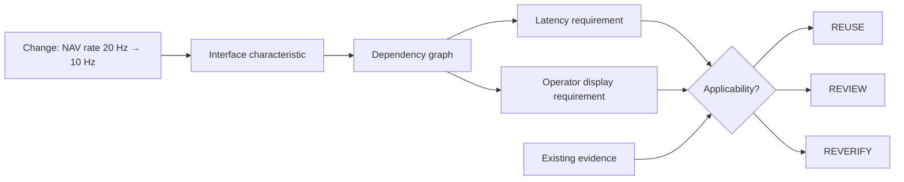

# Interface Change-Impact Reasoning

A subsystem replacement is rarely just a part-number change. The relevant question is whether the characteristics relied upon by other parts of the system remain equivalent.

## Interface dimensions

A practical interface review can include:

| Dimension | Example questions |
|---|---|
| Mechanical | Mass, center of gravity, mounting, envelope, vibration path? |
| Electrical | Voltage, current, inrush, grounding, connector, protection? |
| EMC/EMI | Conducted/radiated emissions or susceptibility changed? |
| Data | Message format, encoding, packet structure, bandwidth? |
| Protocol | Transport, handshake, error handling, state behavior? |
| Timing | Update rate, latency, jitter, timestamp semantics? |
| Semantic | Do fields mean the same thing and use the same units/reference frames? |
| Environmental | Temperature, pressure, vibration, humidity limits? |

## Synthetic example

Assume a navigation source changes from **20 Hz** to **10 Hz** while the electrical connector and nominal voltage remain unchanged.

A connector-only inspection may say the device *fits*. It does not prove that downstream timing requirements remain satisfied.

A traceable impact analysis asks which requirements depend on `NAV_MESSAGE_RATE`. Those requirements become candidates for **REVERIFY**. Requirements with no traced dependency may be candidates for **REUSE**, while evidence tied to an older configuration can be sent to **REVIEW**.

The diagram is a reasoning model, not a claim that an automated tool can approve airworthiness or certification.
