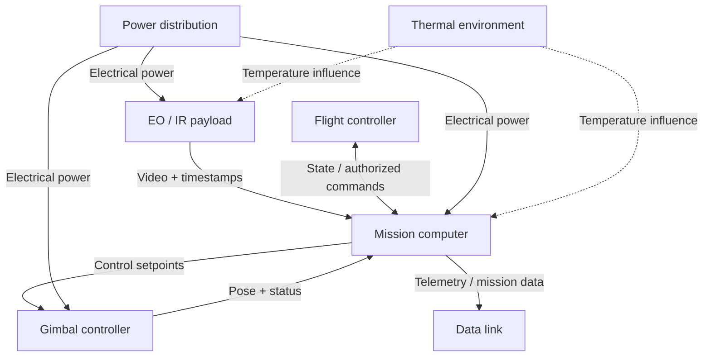
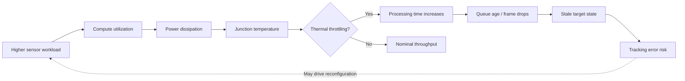
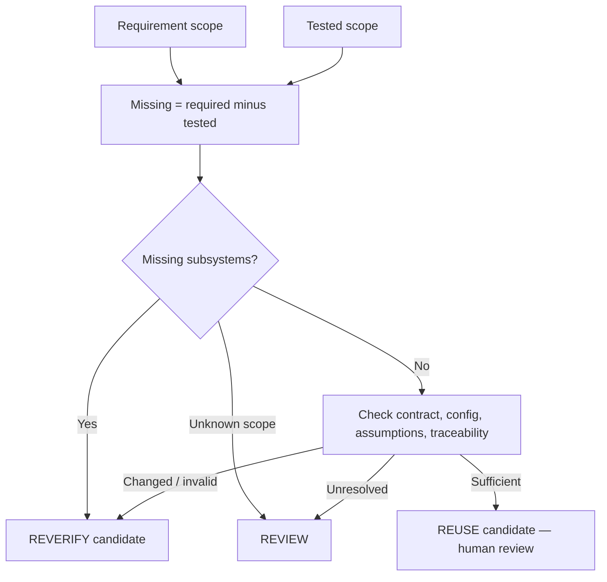
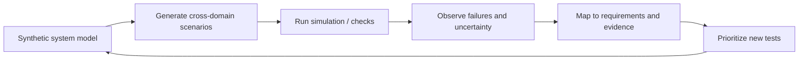

# Visual engineering atlas — synthetic UAV integration

> Conceptual research diagrams, not validated hardware architecture, design assurance, or airworthiness evidence. All arrows are hypotheses to test. Mermaid diagrams render directly in GitHub and remain editable as text.

## 1. Subsystem topology

## 2. Cross-domain causal chain (research hypothesis)

## 3. Evidence coverage and decision graph

## 4. Verification feedback loop

## Visual conventions

- Solid arrows: declared or modeled flow, with an explicit edge label.
- Dashed arrows: hypothesized influence, not established causality.
- Decision diamonds: explicit branch conditions.
- Evidence decisions are advisory; no diagram alone proves compatibility.

## Next visualization candidates

Parameter dependency matrix; temporal sequence diagram; configuration/evidence traceability graph; thermal-power-performance envelope; scenario coverage heatmap; counterexample/failure propagation graph. Each should be linked to a test fixture or a clearly labeled research hypothesis.
